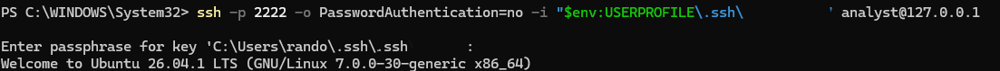
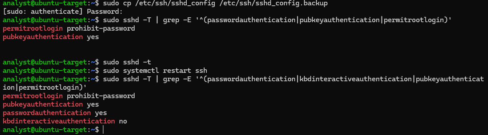
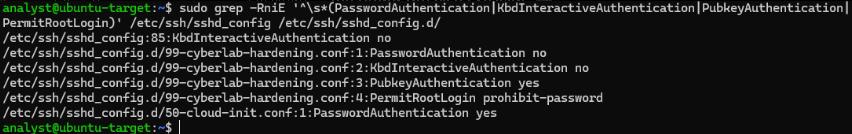
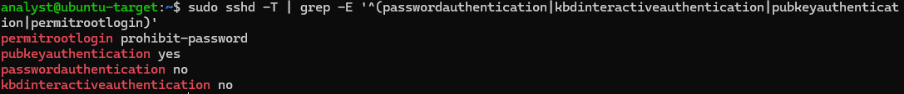

# SSH Hardening

## 1. SSH Key Authentication

### Objective

Configure SSH public-key authentication to provide a more secure method
of remotely accessing the Ubuntu server.

### Configuration

An ED25519 SSH key pair was generated and used for authentication. The
public key was added to the `analyst` user's `authorized_keys` file on
the Ubuntu server.

### Validation

Key-based authentication was successfully tested with SSH password
authentication explicitly disabled for the connection.

The server was successfully accessed using the SSH private key,
confirming that password-based SSH authentication was not required for
this connection.




---

## 2. SSH Baseline Configuration

Before applying the SSH hardening configuration, the effective SSH
configuration was checked.

The initial configuration showed:

- `PasswordAuthentication`: `yes`
- `PubkeyAuthentication`: `yes`
- `PermitRootLogin`: `prohibit-password`

This established the baseline configuration before security changes
were applied.

The baseline configuration can also be seen in the SSH configuration
verification evidence in the next section.

---

## 3. SSH Hardening Configuration

A dedicated SSH hardening configuration was created to improve the
authentication security of the server.

The intended configuration was:

```text
PasswordAuthentication no
KbdInteractiveAuthentication no
PubkeyAuthentication yes
PermitRootLogin prohibit-password
```

The SSH configuration was syntax-checked using:

```bash
sudo sshd -t
```

The configuration passed the syntax check without errors.

The SSH service was then restarted so that the configuration changes
could be applied.



---

## 4. Configuration Conflict and Troubleshooting

After the initial hardening configuration was applied, the effective
SSH configuration did not immediately reflect the intended
`PasswordAuthentication no` setting.

The SSH configuration files were investigated to identify conflicting
settings.

A conflicting configuration was found in:

```text
/etc/ssh/sshd_config.d/50-cloud-init.conf
```

This configuration contained:

```text
PasswordAuthentication yes
```

The investigation also showed the dedicated hardening configuration:

```text
/etc/ssh/sshd_config.d/99-cyberlab-hardening.conf
```

which contained the intended security settings.

The conflict demonstrated that multiple SSH configuration files can
affect the final effective SSH configuration.

The hardening configuration was therefore placed later in the
configuration order so that the intended security settings would take
precedence.



---

## 5. Final SSH Hardening Verification

After correcting the configuration conflict, the effective SSH
configuration was checked again.

The final configuration showed:

- `PasswordAuthentication`: `no`
- `KbdInteractiveAuthentication`: `no`
- `PubkeyAuthentication`: `yes`
- `PermitRootLogin`: `prohibit-password`

The SSH configuration was syntax-checked successfully and the SSH
service was restarted.

This confirmed that password-based SSH authentication had been
disabled while public-key authentication remained enabled.



---

## 6. Security Outcome

The SSH service was successfully hardened by:

- Disabling password-based SSH authentication.
- Disabling keyboard-interactive authentication.
- Retaining public-key authentication.
- Preventing password-based root SSH authentication.
- Validating the SSH configuration before applying changes.
- Identifying and resolving a configuration precedence conflict.

The final effective SSH configuration was verified using `sshd -T`.

The configuration conflict with `cloud-init` was identified and resolved,
demonstrating the importance of verifying the effective SSH
configuration rather than relying only on the contents of a single
configuration file.
