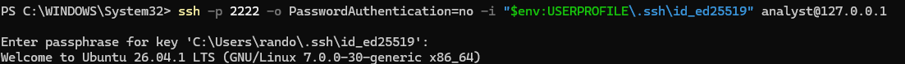

## SSH Key Authentication

### Objective

Configure SSH public-key authentication to provide a more secure
method of remotely accessing the Ubuntu server.

### Configuration

An ED25519 SSH key pair was used for authentication. The public key
was added to the `analyst` user's `authorized_keys` file on the
Ubuntu server.

### Validation

Key-based authentication was successfully tested with SSH password
authentication explicitly disabled for the connection.

The server was successfully accessed using the SSH private key,
confirming that password-based SSH authentication was not required
for this connection.

